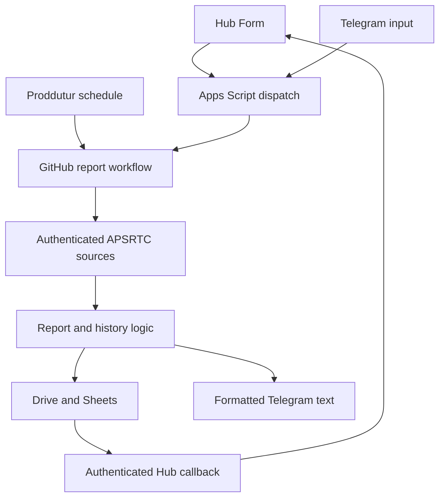
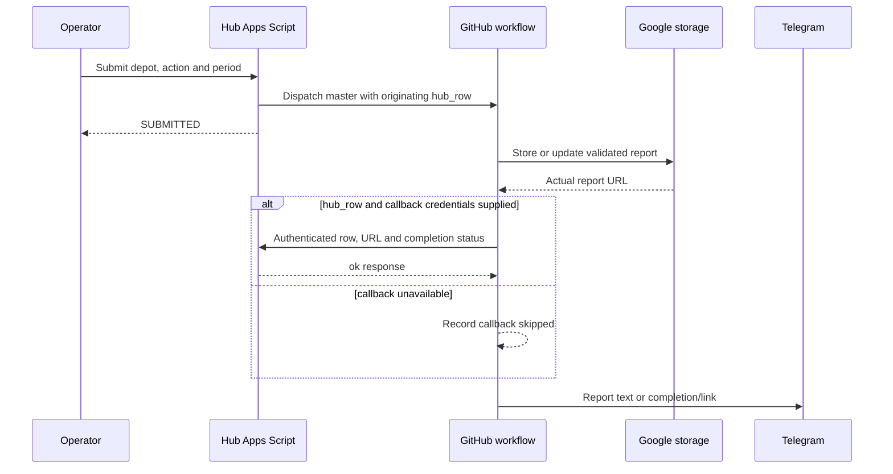
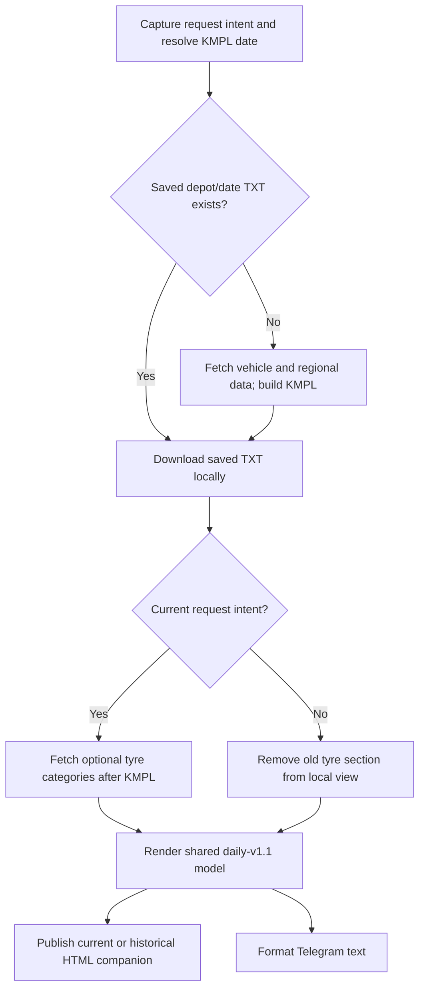
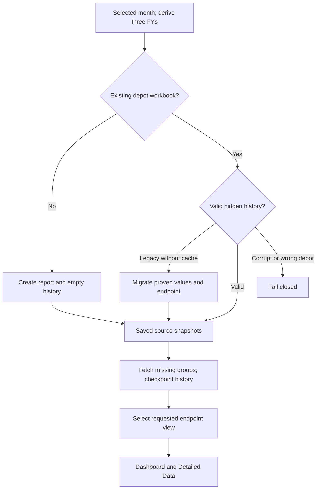
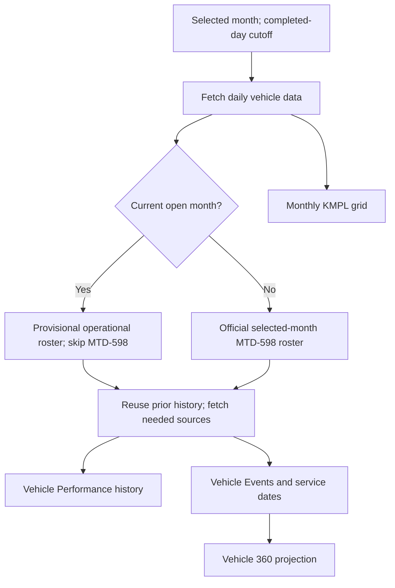

# Architecture and execution flows

Reviewed on 3 October 2026 against [production 54dcf6b](https://github.com/imranshaik-pro/apsrtc-kmpl/commit/54dcf6bd760bbf60d728ce1aee8677b54021b177). Request contracts and field lineage are in [data sources](data-sources.md).

## Components and boundaries

| Layer | Production responsibility | Files |
| --- | --- | --- |
| Request channels | Depot/action/period selection, validation and workflow dispatch | [Hub](../apps-script/automation_hub.gs), individual form triggers, [bot](../telegram_command_bot.py), [Apps Script bot](../deploy/telegram_webhook_apps_script.gs) |
| Execution | Short-lived report jobs; Proddutur schedule; manual selected-depot jobs | [Daily](../.github/workflows/daily-report.yml), [monthly](../.github/workflows/monthly-report.yml), [annual](../.github/workflows/annual-kpi.yml) |
| Source access | Authenticated APSRTC session and report-specific fields | [Auth](../src/auth/client.py), daily application, monthly vehicle/history modules, annual adapters |
| Calculation | Independent vehicle Day/Upto ratios, consolidation, rounding and slabs | [Pipeline](../src/calculations/pipeline.py) |
| Persistent data | Original daily TXT, native monthly report, annual hidden cache, permanent Vehicle Events | [Drive](../src/integrations/google_drive.py), [Sheets](../src/integrations/google_sheets.py), [annual history](../annual_history.py), event API |
| Presentation | Telugu daily, coloured daily HTML, workbook tabs/charts, Telegram text | [Daily model](../src/reporting/daily_template.py), [annual visuals](../annual_visuals.py), monthly workbook |
| Delivery/return | Actual Google URL, authenticated Hub row callback and Telegram API | Workflow callback/delivery steps; callback deployment tracked separately in PR #4 |

Forms/Telegram select the request; source adapters establish values. Python rendering does not update a live Apps Script deployment. Input polling modes are alternatives, not concurrent bot consumers.

## Hub dispatch and callback sequence

A workflow can generate a report with callback skipped. That does not certify a completed Hub row. The active external version-7 callback is recorded in PR #4; the two doPost definitions on master must not be blindly pasted into one Apps Script project. PR #4 routes Hub callbacks through the existing vehicle handler.

## Daily source, cache and tyre sequence

The original cached Drive TXT is preserved. A fresh report can upload combined TXT; a cached current request refreshes tyres in its local copy. HTML companions have separate current/historical names and may refresh. Historical delivery removes local tyre data without making historical tyre requests. Scheduled delivery suppresses a repeat when the TXT already exists; a manual request can deliberately redeliver.

Optional tyre errors produce unavailable notes and preserve completed KMPL. A failed mandatory vehicle source prevents report generation before presentation.

## Annual runner inheritance and active overrides

The production workflow executes annual_kpi_runner_v11.py, not every runner named in the repository. Imports share and replace function symbols:

| Import / override | Effective responsibility |
| --- | --- |
| v11 imports v10; v10 captures original v3 web tyre fetch before importing v8 | Prevents recursive wrapper calls for supported tyre-web FYs |
| v8 imports v7, which imports v6 → v5 → v4 → v3 | Shared m is the v3 module; changes to its symbols affect both depots |
| v4 assigns m.direct_dimension_rows = strict_dimension_rows | Active Product/Engine body indexes are month=3 and Upto=6; newer v3 helper presence does not establish use |
| v8 assigns m.fetch_lub = fetch_lub_depotwise | Verified yymm POST, returned-month validation and exact depot-wise Total Lub columns |
| v10.fetch_tyre_v10 | FY24-25 exact booklet adapter; supported later FYs use captured original web implementation |
| v11.main_v11 | Loads/migrates original persistent KPI history, dispatches missing groups, selects view, and adds two separately cached source-detail views to the original two tabs |
| v11 uses v10.ORIGINAL_POPULATE_TARGETS | April targets-only path; deliberately bypasses v10's all-month backfill/unavailability wrapper |

This shared path does not prove a Proddutur-only old parser. The unresolved legacy Engine labels and lack of an authoritative crosswalk are recorded in [known issues](annual-kpi-known-issues.md). Old wrapper functions/docstrings can describe rules that the active v11 main no longer invokes.

## Annual history sequence

Source errors during missing-value repair preserve supported saved fields. Persist migration before modifying visible tabs. Known FY24 LUB/SPRING unavailability is explicit. Targets are attempted once per FY. A versioned Engine refresh adds exact source identities without relabelling retained engines.

Selecting May after July changes the view and May Upto endpoint; it does not delete June/July cached data or recompute historical FYs. The cache checksum covers saved chunks; it cannot certify that the original source classified a legacy engine correctly.

The [Monthly/Annual detail extension](monthly-annual-detail-tabs.md) follows a separate path: B/F total-size tyre rows and the combined engine/product UD/UM matrix → `_REPORT_DETAILS_HISTORY` → two generated views. This cache does not rewrite the legacy `_ANNUAL_HISTORY` engine labels. Its own missing/provisional month snapshots and selected UM refresh have independent fetch rules.

## Monthly and Vehicle 360 lifecycle

The latest earlier same-depot workbook seeds history. New vehicles require historical backfill. Current vehicle history uses the fixed FY24-25/FY25-26/FY26-27 configuration; annual's three-FY window is dynamically derived. Event display uses selected depot and cutoff; provisional population candidate handling is separately described in the [business rules](business-rules-and-lessons.md).

Standalone Vehicle 360 Hub/bot lookup is not implemented. The monthly workbook projection already exists.

## Legacy and alternative execution paths

- run_daily_report.py is the direct daily core CLI; run_automated_daily.py adds request resolution, Drive cache, optional tyres and styled companions.
- process_requests.py, generate_report.py and shell/Docker wrappers are earlier local/poller entry points. Do not assume they have all workflow-runner behaviours.
- Annual report/incremental/v3–v10 files remain dependencies or older entry points; annual-kpi.yml selects v11.
- Telegram scheduled polling, a Linux listener and Apps Script webhook/polling are alternative ingestion modes. The owner preferred Apps Script to avoid a continuously running server.
- Docker/GHCR publishing is packaging; its success is not report/source/callback acceptance.
